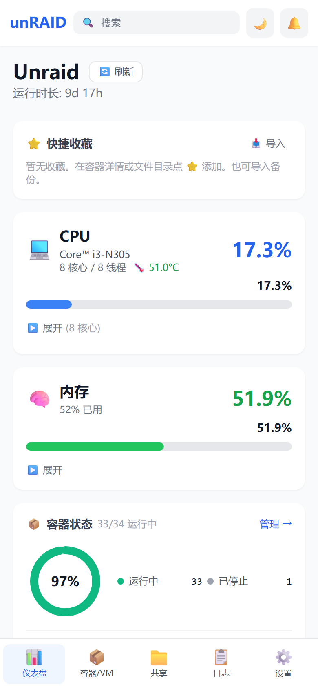
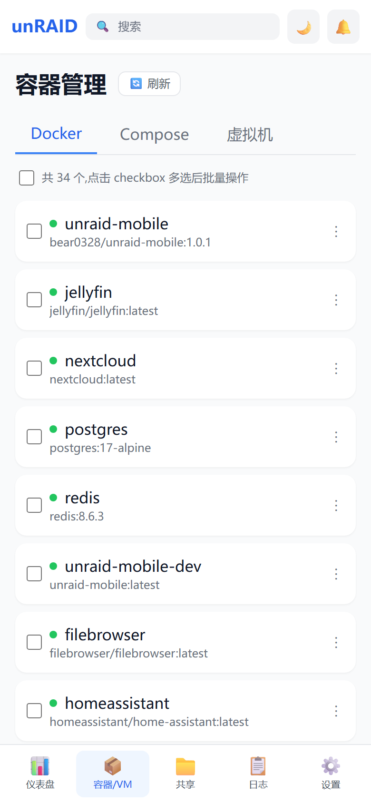
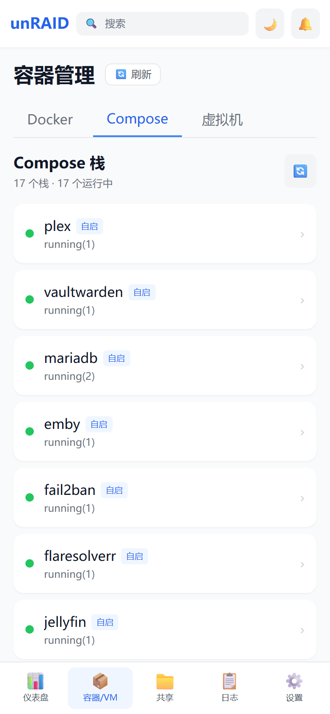
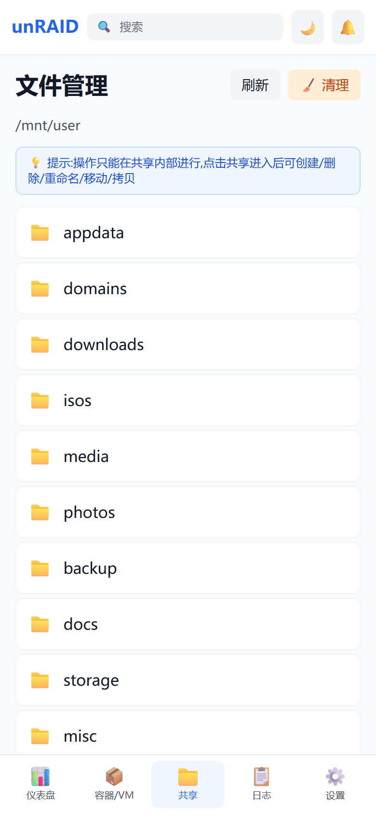
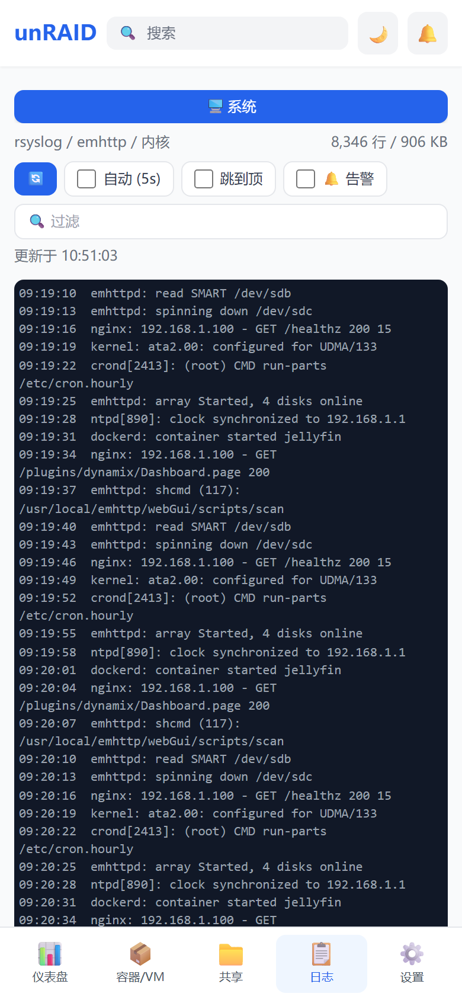
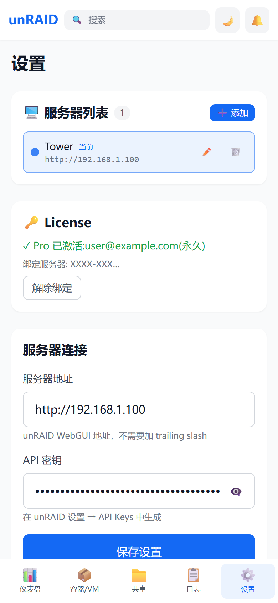

# unRAID Mobile

**[English](README.md)** | 简体中文

[](https://t.me/+l1iA02ZkOK1lNmEx)

专为移动设备优化的 unRAID 服务器管理界面。React 18 + TypeScript + Vite + Tailwind CSS,
单容器部署,数据走 unRAID GraphQL API(7.2+)。

## 界面截图

<p>
  
  
  
</p>
<p>
  
  
  
</p>

## 功能(免费版 / Pro)

| 免费版(开箱即用) | Pro(License key 解锁) |
|------|------|
| 仪表盘全部监控:CPU / 内存 / 网络 / 磁盘 / 阵列 / 历史曲线 / 收藏 | 容器详情(端口/挂载/网络/磁盘占用)、容器日志 |
| 容器 / VM 列表 + 单个启停 / 重启 / 暂停 | VM 详情 |
| Shares 文件浏览 / 下载 / 图片预览 | **Compose 栈管理**(列表/日志/up/down/pull/rebuild/yaml 编辑)¹ |
| 宿主系统日志(syslog) | **CPU 温度**¹(直读 /sys/class/hwmon,不唤盘)、Shares 写操作(上传/新建/删除/重命名/文本编辑) |
| 全局搜索、命令面板、配置备份/导入、单服务器、深色主题、PWA | 容器批量操作、**多服务器**、告警通知(Webhook)、磁盘清理 |

¹ 依赖宿主后端(compose-api)——需按下方「Pro 宿主后端」一节在 unRAID 宿主安装小组件,
**安装会修改开机脚本 `/boot/config/go`,请先知悉其中的风险说明**。免费版无需安装任何东西。

Pro 为**买断制**:一次付费永久使用(含 1 年更新)。在「设置 → License」输入 key 即解锁,
全程离线验证,不联网、不上传任何数据。购买渠道见 GitHub Releases / 后续公告。

## 快速开始(Docker Hub 镜像)

```bash
docker run -d \
  --name unraid-mobile \
  -p 3999:80 \
  -e UNRAID_UPSTREAM=http://192.168.1.100:8001 \
  -v /mnt/user/appdata/unraid-mobile/config:/usr/share/nginx/html/config \
  bear0328/unraid-mobile:latest
```

`UNRAID_UPSTREAM` 填你的 unRAID webGui 地址(不带尾部斜杠)——容器内 nginx 把 `/graphql`
反代到这里。**填错则全部 API 请求 502。**

打开 `http://<unraid-IP>:3999`,进「设置」页填:

1. **服务器地址** — 如 `http://192.168.1.100`(填 unRAID webGui 地址,不带尾部斜杠)
2. **API 密钥** — unRAID GraphQL API key(webGui → Settings → API Keys 生成)

> apiKey 只存在你自己浏览器的 localStorage,**不会**写到服务器任何文件。

镜像 tag:`latest`(最新稳定) / `1.0.0`(固定版本)。仅 linux/amd64(unRAID 平台)。

### 功能 ↔ 挂载对照表

基础功能(仪表盘/容器/VM/设置)**零挂载可用**。进阶功能按需加挂载:

| 功能 | 挂载 / 依赖 | 说明 |
|------|------------|------|
| 配置持久化 | `-v .../config:/usr/share/nginx/html/config` | 只存 serverUrl,建议加 |
| 文件管理 | `-v /mnt/user:/mnt/user` + `-v /mnt/cache:/mnt/cache` + WebDAV 密码文件 | 密码在设置页输入,与 nginx `.davpasswd` 一致 |
| 宿主系统日志 | `-v /var/log:/mnt/hostlog:ro` + 日志密码文件 | 同上,`.logpasswd` |
| Compose 栈管理 / CPU 温度(Pro) | `-v /var/run/php-fpm.sock:/hostrun/php-fpm.sock` + 宿主后端 | 见下节 |

完整 docker-compose 示例:

```yaml
services:
  unraid-mobile:
    image: bear0328/unraid-mobile:latest
    container_name: unraid-mobile
    ports:
      - "3999:80"
    environment:
      - UNRAID_UPSTREAM=http://192.168.1.100:8001  # 改成你的 unRAID 地址
    volumes:
      - /mnt/user/appdata/unraid-mobile/config:/usr/share/nginx/html/config
      # 按需取消注释:
      # - /mnt/user:/mnt/user
      # - /mnt/cache:/mnt/cache
      # - /var/log:/mnt/hostlog:ro
      # - /var/run/php-fpm.sock:/hostrun/php-fpm.sock
    restart: unless-stopped
```

## Pro 宿主后端(compose-api):Compose 栈管理 + CPU 温度

Compose tab 和 CPU 温度(均为 Pro 功能)依赖一个宿主端小组件(`api.php`,经宿主 php-fpm
以 root 执行 `docker compose` / 直读 `/sys/class/hwmon`,不会唤醒休眠硬盘)。
未安装时对应功能显示安装指引或占位,**其余功能不受影响**。

> ⚠️ **风险说明(安装前必读)**
> 安装脚本会修改 unRAID 开机脚本 **`/boot/config/go`**(系统启动时执行的核心脚本),
> 用于重启后恢复本组件。保障措施:
> - 修改前自动备份为 `/boot/config/go.unraid-mobile-bak`
> - 仅追加 3 行(带【unraid-mobile】标记),不改动你已有的任何行
> - 脚本执行时会要求输入 `YES` 显式确认
> - 卸载:删除 `/boot/config/plugins/unraid-mobile/` 和 go 里标记的 3 行即完全还原
>
> 如果你不接受对开机脚本的任何修改,不要安装 —— 免费版的全部功能都不需要它。

安装前提:已通过 Community Applications 安装 **compose.manager** 插件。

```bash
# 在 unRAID 宿主上以 root 执行
mkdir -p /tmp/um-install && cd /tmp/um-install
curl -fsSL -o install-compose-api.sh \
  https://raw.githubusercontent.com/bear0328/unraid-mobile/v1.0.2/compose-api/install-compose-api.sh
curl -fsSL -o api.php \
  https://raw.githubusercontent.com/bear0328/unraid-mobile/v1.0.2/compose-api/api.php
bash install-compose-api.sh
```

脚本会:风险确认(输 YES)→ 校验 compose.manager → 交互式收 apiKey 写入
`/boot/config/plugins/unraid-mobile/apikey`(600,存 `sha256:` 哈希,明文不落 flash 盘)
→ 装 api.php 到 compose.manager 插件目录 → 备份并加 `/boot/config/go` 恢复钩子。幂等,可重复跑。

装完给容器加上 php-fpm.sock 挂载并重建,Compose tab 与 CPU 温度(Pro 激活后)即可用。

## 从源码构建

```bash
git clone https://github.com/bear0328/unraid-mobile.git
cd unraid-mobile
npm ci
npm run build        # 产物在 dist/
npm test             # vitest
docker build -t unraid-mobile .
```

## unRAID GraphQL API 限制说明

### Docker 容器
| 功能 | 支持 | 字段 |
|------|------|------|
| 列表 | ✅ | id, names, image, state, status, autoStart, created |
| 日志 | ✅ | logs(tail) { lines { timestamp, message } } |
| 统计 | ✅ | stats { cpuPercent, memUsage, memPercent }(订阅) |
| 启停 | ✅ | mutation |
| 端口映射 / 挂载 / 网络 / 磁盘占用 | ✅ | ports / mounts / networkSettings / size*(详情查询) |

### 虚拟机
| 功能 | 支持 | 字段 |
|------|------|------|
| 列表 | ✅ | domains { name, uuid, state } |
| 启停 | ✅ | mutation |
| 日志 / 内存 / CPU / 磁盘 | ❌ | API 无此字段 |

## 常见问题

**Q: 有问题去哪讨论 / 反馈?**
加 Telegram 交流群:<https://t.me/+l1iA02ZkOK1lNmEx>,或在 GitHub 提 issue。

**Q: API 连接失败?**
检查服务器地址格式(不带尾部斜杠)、API 密钥是否有效、容器到 unRAID webGui 网络是否通。

**Q: 容器详情里端口/标签/网络是空的?**
端口/挂载/网络/磁盘占用属于 Pro 功能,激活后在详情页可见;仍为空则是该容器本身无此配置(如 host 网络无端口映射)。

**Q: 换手机/浏览器后要重输 API 密钥?**
是。apiKey 只存浏览器 localStorage,不跟设备走;服务器端不落任何凭证。

## License 与商业化

本仓库代码以 **Business Source License 1.1(BSL)** 授权(见 [LICENSE](LICENSE)):

- ✅ 个人/家庭自托管:随意用、随意改、随意自建(不限服务器台数)
- ✅ 每个版本发布满 4 年后,该版本自动转为 MIT 完全自由许可
- ❌ 禁止转售、禁止把本软件做成收费/托管服务提供给第三方

商业化形式:代码全部公开,**Pro 功能通过离线 license key 解锁**(设置页输入即可,
买断制,不联网验证)。**1 枚 key 绑定 1 台 unRAID 服务器**(按 U 盘 flashGuid 校验,
重装系统不影响;更换 U 盘后联系重签),**最多可在 3 台设备**(手机/浏览器)上激活,
旧设备「解除绑定」即释放名额。离线 key 的技术性质是"防君子不防高手"——真正的商用保护
由 BSL 许可证兜底。如果你喜欢这个项目,购买 Pro 是对开发最直接的支持。
